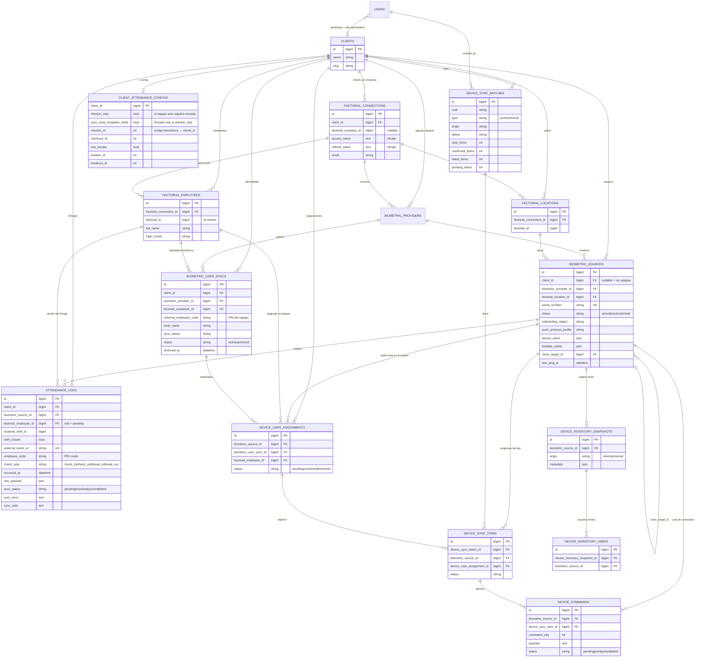
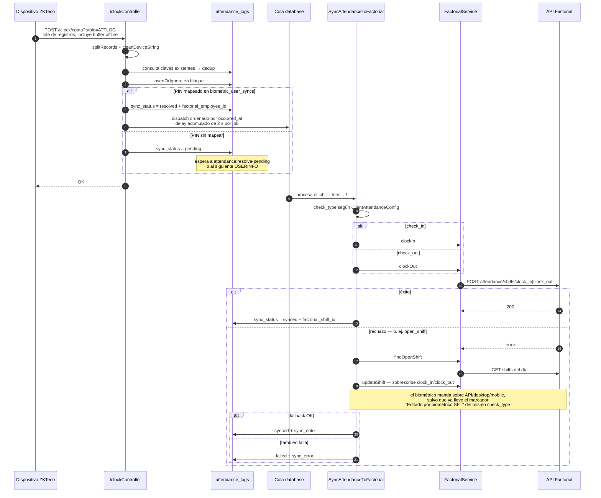
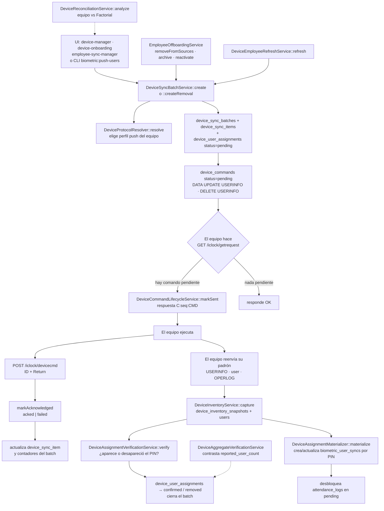
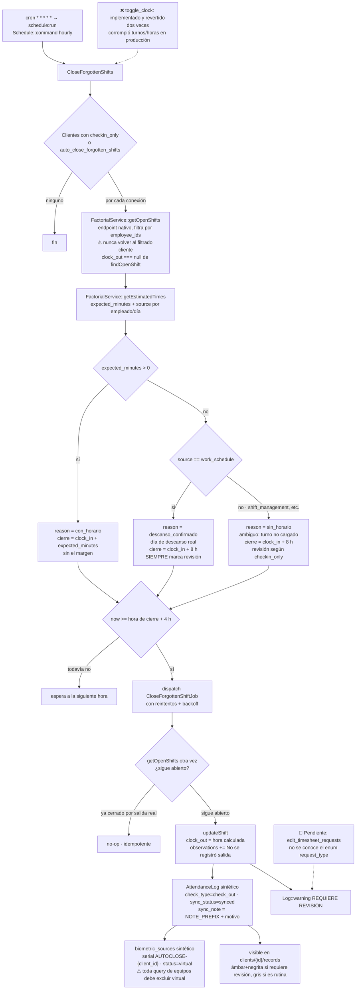

# Sintelc FlowTime — Esquema de arquitectura (Mermaid)

Generado el 2026-09-01 a partir del código en `main`.
Cinco vistas: global, modelo de datos, flujo de asistencia, aprovisionamiento de
usuarios al dispositivo y cierre de turnos olvidados.

---

## 1. Vista global — de la ponchada a Factorial

```mermaid
flowchart TB
    subgraph CAMPO["🏢 Campo — sedes del cliente"]
        ZK["Dispositivos ZKTeco<br/>huella · rostro · tarjeta"]
        MLA["Cámaras Provision / MLA<br/>integración en curso"]
    end

    subgraph HTTP["🌐 Capa HTTP — /iclock/* · sin auth · sin CSRF"]
        PING["GET/POST /iclock/ping"]
        GETREQ["GET /iclock/getrequest<br/>el equipo pregunta por comandos"]
        CDATA["POST /iclock/cdata?table=..."]
        DEVCMD["POST /iclock/devicecmd<br/>ACK de comando ejecutado"]
        REG["GET /iclock/registry"]
        PUSH["GET /iclock/push"]
    end

    subgraph CTRL["🎛️ IclockController — handlers por tabla"]
        H_ATT["handleAttlog<br/>fichajes en lote"]
        H_RT["handleRtlog<br/>fichaje en tiempo real"]
        H_USER["handleUserInfo<br/>USERINFO · user"]
        H_OP["handleOperlog<br/>OPERLOG"]
        H_BIO["handleBiodata<br/>BIODATA · clonado"]
    end

    subgraph SVC["⚙️ Servicios de dispositivo"]
        S_INFO["DeviceInfoService<br/>firmware · contadores"]
        S_INV["DeviceInventoryService<br/>snapshot del padrón"]
        S_VER["DeviceAssignmentVerificationService<br/>confirma altas/bajas"]
        S_MAT["DeviceAssignmentMaterializer<br/>PIN → identidad"]
        S_LIFE["DeviceCommandLifecycleService<br/>sent → acked"]
        S_BATCH["DeviceSyncBatchService<br/>crea lotes + comandos"]
        S_ONB["DeviceOnboardingService"]
        S_PROTO["DeviceProtocolResolver<br/>perfil push del equipo"]
        S_REC["DeviceReconciliationService"]
        S_REF["DeviceEmployeeRefreshService"]
        S_AGG["DeviceAggregateVerificationService"]
        S_OFF["EmployeeOffboardingService"]
    end

    subgraph DB["🗄️ MySQL"]
        T_LOG["attendance_logs<br/>pending → resolved → synced/failed"]
        T_SRC["biometric_sources"]
        T_SYNC["biometric_user_syncs<br/>mapa PIN ↔ empleado"]
        T_ASG["device_user_assignments"]
        T_CMD["device_commands"]
        T_BATCH["device_sync_batches / items"]
        T_INV["device_inventory_snapshots / users"]
        T_EMP["factorial_employees"]
        T_CONN["factorial_connections<br/>tokens OAuth cifrados"]
        T_CFG["client_attendance_configs"]
    end

    subgraph QUEUE["📮 Cola — driver database · 1 worker Supervisor"]
        J_SYNC["SyncAttendanceToFactorial<br/>tries=1"]
        J_CLOSE["CloseForgottenShiftJob<br/>reintentos + backoff"]
        J_CONN["SyncFactorialConnection"]
        J_CSV["ProcessCsvAutoMatch"]
    end

    FS["🔌 FactorialService<br/>un objeto por FactorialConnection"]
    FAPI["☁️ API Factorial HR"]

    subgraph CRON["⏰ Scheduler + CLI"]
        SCHED["cron → schedule:run<br/>attendance:close-forgotten-shifts · hourly"]
        CMD1["attendance:resolve-pending"]
        CMD2["factorial:sync-employees / sync-locations"]
        CMD3["biometric:push-users"]
        CMD4["factorial:list-open-shifts"]
        CMD5["attendance:import-attlog-dat"]
    end

    subgraph UI["🖥️ UI — Livewire Volt · auth + rol"]
        U_DASH["dashboard/attendance-stats<br/>dashboard/device-status"]
        U_DEV["devices/device-manager<br/>devices/device-onboarding"]
        U_EMP["employees/employee-sync-manager"]
        U_CLI["clients/client-manager · client-profile<br/>clients/attendance-records"]
        U_CONN["connections/connection-manager"]
    end

    OAUTH["FactorialAuthController<br/>/oauth/factorial/redirect · callback"]

    ZK --> PING & GETREQ & CDATA & DEVCMD & REG & PUSH
    MLA -.->|"pendiente de definir"| CDATA

    CDATA --> H_ATT & H_RT & H_USER & H_OP & H_BIO
    GETREQ --> S_INFO
    GETREQ -->|"saca el comando pendiente"| T_CMD
    GETREQ --> S_LIFE
    DEVCMD --> S_LIFE

    H_ATT --> T_LOG
    H_RT --> T_LOG
    H_USER --> S_INV
    H_OP --> S_INV
    H_BIO --> T_CMD

    S_INV --> T_INV
    S_INV --> S_VER
    S_INV --> S_MAT
    S_VER --> T_ASG
    S_VER --> T_BATCH
    S_MAT --> T_SYNC
    S_MAT --> T_ASG
    S_LIFE --> T_CMD
    S_BATCH --> T_BATCH & T_CMD & T_ASG
    S_BATCH --> S_PROTO
    S_ONB --> T_CMD
    S_ONB --> S_PROTO
    S_OFF --> S_BATCH
    S_REF --> S_BATCH
    S_INFO --> T_SRC

    H_ATT -->|"dispatch ordenado por occurred_at<br/>delay 2s entre jobs"| J_SYNC
    H_RT --> J_SYNC
    CMD1 --> J_SYNC
    J_CSV --> J_SYNC

    SCHED --> CLOSE_CMD["CloseForgottenShifts"]
    CLOSE_CMD --> FS
    CLOSE_CMD --> J_CLOSE

    J_SYNC --> FS
    J_CLOSE --> FS
    J_CONN --> FS
    CMD2 --> FS
    CMD4 --> FS
    CMD3 --> S_BATCH

    J_SYNC --> T_LOG
    J_CLOSE -->|"log sintético de cierre"| T_LOG
    J_CONN --> T_EMP
    FS <--> T_CONN
    FS <--> FAPI

    OAUTH --> T_CONN
    OAUTH --> FS

    U_DEV --> S_ONB & S_INV & S_REC & S_BATCH
    U_EMP --> S_OFF
    U_EMP --> J_CONN & J_SYNC
    U_CONN --> J_CONN
    U_CLI --> T_CFG
    U_DASH --> T_LOG & T_SRC
    U_CLI --> T_LOG

    T_CFG -.->|"check_type · checkin_only ·<br/>auto_close_forgotten_shifts"| H_ATT
    T_CFG -.-> CLOSE_CMD
    T_SYNC -.->|"resuelve employee_code →<br/>factorial_employee_id"| H_ATT

    classDef device fill:#dcecef,stroke:#3f8b99,color:#0e2a30
    classDef store fill:#f6ecd8,stroke:#c09a4e,color:#3a2f16
    classDef job fill:#e7e3f4,stroke:#8b7fc4,color:#241f3d
    classDef ext fill:#dff0e2,stroke:#5aa86e,color:#153020
    class ZK,MLA device
    class T_LOG,T_SRC,T_SYNC,T_ASG,T_CMD,T_BATCH,T_INV,T_EMP,T_CONN,T_CFG store
    class J_SYNC,J_CLOSE,J_CONN,J_CSV job
    class FAPI,FS ext
```

---

## 2. Modelo de datos

---

## 3. Flujo de un fichaje hasta Factorial

---

## 4. Aprovisionamiento de usuarios en el equipo

---

## 5. Cierre de turnos olvidados — `attendance:close-forgotten-shifts`

